# Project Management Dashboard — System Analysis, Architecture & UML Diagrams

> **Project:** Project Management Dashboard with Interactive Gantt Chart Visualization  
> **Tech Stack:** React.js · Node.js · Express.js · MongoDB  
> **Date:** February 2026

---

## Table of Contents

1. [Existing System](#1-existing-system)
2. [Proposed System](#2-proposed-system)
3. [Comparison — Existing vs Proposed](#3-comparison--existing-vs-proposed)
4. [System Architecture](#4-system-architecture)
   - 4.1 High-Level Architecture
   - 4.2 Client-Side Architecture
   - 4.3 Server-Side Architecture
   - 4.4 Deployment Architecture
5. [UML Diagrams](#5-uml-diagrams)
   - 5.1 Use Case Diagram
   - 5.2 Class Diagram
   - 5.3 Sequence Diagrams
   - 5.4 Activity Diagrams
   - 5.5 Component Diagram
   - 5.6 Entity-Relationship (ER) Diagram
   - 5.7 State Diagram
   - 5.8 Data Flow Diagram (DFD)

---

## 1. Existing System

### 1.1 Overview

Traditional project management in many organizations relies on **manual or semi-automated** methods. The most common approaches include:

| Method | Description |
|--------|-------------|
| **Spreadsheets (Excel/Google Sheets)** | Teams maintain project timelines, task lists, and resource allocation in disconnected spreadsheet files. |
| **Email-Based Tracking** | Project updates, task assignments, and progress reports are circulated via email threads. |
| **Standalone Desktop Tools** | Tools like MS Project are used locally on individual machines without real-time collaboration. |
| **Physical Whiteboards / Paper** | Some teams still use sticky notes, Kanban boards, or printed Gantt charts for tracking. |

### 1.2 Problems with the Existing System

| # | Problem | Impact |
|---|---------|--------|
| 1 | **No Centralized Data** | Project information is scattered across spreadsheets, emails, and documents; difficult to get a single source of truth. |
| 2 | **Manual Progress Tracking** | Managers must manually collect and compile status updates; highly error-prone and time-consuming. |
| 3 | **No Real-Time Visibility** | Stakeholders cannot see project/task status in real time; decisions are based on outdated information. |
| 4 | **Poor Resource Management** | No way to track resource utilization, availability, or workload balance across projects. |
| 5 | **No Task Dependency Tracking** | Task dependencies are not modeled; schedule impacts of delays are invisible. |
| 6 | **Lack of Interactive Visualization** | Static Gantt charts in spreadsheets are difficult to update and do not support drag-and-drop rescheduling. |
| 7 | **No Authentication / Access Control** | Sensitive project data is open to everyone or relies on file-level sharing permissions. |
| 8 | **Collaboration Bottlenecks** | Teams working in silos without a shared platform leads to miscommunication and duplicated effort. |
| 9 | **No Dashboard / KPIs** | No automated dashboard to show KPIs like project completion rates, delayed tasks, or budget usage. |
| 10 | **Scalability Issues** | Spreadsheet-based systems break down as the number of projects and team members grows. |

### 1.3 Existing System Diagram

```
┌─────────────────────────────────────────────────────────┐
│                   EXISTING SYSTEM                       │
├─────────────────────────────────────────────────────────┤
│                                                         │
│  ┌──────────┐   Email    ┌──────────┐                   │
│  │ Manager  │◄──────────►│  Team    │                   │
│  │          │   Updates  │ Members  │                   │
│  └────┬─────┘            └────┬─────┘                   │
│       │                       │                         │
│       ▼                       ▼                         │
│  ┌──────────┐           ┌──────────┐                    │
│  │  Excel   │           │  Excel   │  ◄── Separate      │
│  │ Tracker  │           │ Tracker  │      files per     │
│  └──────────┘           └──────────┘      person        │
│       │                       │                         │
│       ▼                       ▼                         │
│  ┌──────────────────────────────────┐                   │
│  │     Manual Compilation           │                   │
│  │  (Copy-paste, reconcile data)    │                   │
│  └──────────────┬───────────────────┘                   │
│                 │                                       │
│                 ▼                                       │
│  ┌──────────────────────────────────┐                   │
│  │    Static Reports / Printouts    │                   │
│  │    (Outdated by the time sent)   │                   │
│  └──────────────────────────────────┘                   │
│                                                         │
└─────────────────────────────────────────────────────────┘
```

---

## 2. Proposed System

### 2.1 Overview

The **Project Management Dashboard** is a full-stack, web-based application that provides a **centralized, real-time platform** for managing projects, tasks, resources, and timelines. It replaces manual workflows with automated, interactive features.

### 2.2 Key Features of the Proposed System

| Module | Features |
|--------|----------|
| **Dashboard** | Real-time KPIs, task/project status distribution charts (Chart.js), recent activities, upcoming deadlines, monthly trends. |
| **Project Management** | CRUD operations for projects; search, filter, sort, pagination; auto-status detection (delayed projects); budget tracking; color-coded priorities. |
| **Task Management** | CRUD tasks per project; task dependencies, milestones, progress tracking; estimated vs actual hours; assignment to resources; priority levels. |
| **Gantt Chart** | Interactive Gantt visualization (dhtmlx-gantt); drag-and-drop scheduling; dependency arrows; milestone markers; project-level and global views. |
| **Resource Management** | Track team members with roles, skills, departments; workload/utilization calculation; availability status; hourly rate tracking. |
| **Authentication** | JWT-based secure login; bcrypt password hashing; role-based access (user/admin); token-based route protection. |
| **Settings & Profile** | User profile management; dark/light theme toggle; notification preferences. |
| **Responsive Design** | Fully responsive sidebar-based layout; mobile-friendly; collapsible navigation. |

### 2.3 Advantages of the Proposed System

| # | Advantage | Description |
|---|-----------|-------------|
| 1 | **Centralized Platform** | All project data in one MongoDB database accessible via browser. |
| 2 | **Real-Time Dashboards** | Auto-computed KPIs and charts update as data changes. |
| 3 | **Interactive Gantt Charts** | Drag-and-drop task rescheduling with dependency visualization. |
| 4 | **Automated Calculations** | Project completion %, resource utilization, and delay detection computed automatically. |
| 5 | **Role-Based Access** | JWT authentication ensures only authorized users access data. |
| 6 | **RESTful API Architecture** | Clean separation of frontend and backend enables scalability and third-party integrations. |
| 7 | **Resource Optimization** | Workload tracking prevents over-allocation and identifies underutilized team members. |
| 8 | **Scalable & Modern** | MERN stack supports horizontal scaling; in-memory MongoDB fallback for demos. |
| 9 | **Responsive UI** | Accessible from desktops, tablets, and mobile devices. |
| 10 | **Notifications** | Toast notifications (react-hot-toast) provide instant feedback on actions. |

### 2.4 Proposed System Diagram

```
┌──────────────────────────────────────────────────────────────┐
│                     PROPOSED SYSTEM                          │
├──────────────────────────────────────────────────────────────┤
│                                                              │
│   ┌──────────┐  ┌──────────┐  ┌──────────┐  ┌──────────┐    │
│   │ Manager  │  │Developer │  │  Admin   │  │  Viewer  │    │
│   └────┬─────┘  └────┬─────┘  └────┬─────┘  └────┬─────┘    │
│        │              │              │              │         │
│        └──────┬───────┴──────┬───────┘              │         │
│               │              │                      │         │
│               ▼              ▼                      ▼         │
│  ┌─────────────────────────────────────────────────────┐     │
│  │              Web Browser (Any Device)               │     │
│  │  ┌───────────────────────────────────────────────┐  │     │
│  │  │          React.js Frontend (SPA)              │  │     │
│  │  │  ┌──────────┬──────────┬──────────┬────────┐  │  │     │
│  │  │  │Dashboard │ Projects │  Gantt   │Resources│  │  │     │
│  │  │  │  Page    │  Page    │  Chart   │  Page   │  │  │     │
│  │  │  └──────────┴──────────┴──────────┴────────┘  │  │     │
│  │  │  Context API (Global State) + Axios (HTTP)    │  │     │
│  │  └───────────────────────┬───────────────────────┘  │     │
│  └──────────────────────────┼──────────────────────────┘     │
│                             │ REST API (HTTP/JSON)           │
│                             ▼                                │
│  ┌─────────────────────────────────────────────────────┐     │
│  │           Node.js + Express.js Backend              │     │
│  │  ┌──────────┬──────────┬──────────┬──────────┐      │     │
│  │  │  Auth    │ Project  │  Task    │ Resource │      │     │
│  │  │Controller│Controller│Controller│Controller│      │     │
│  │  └──────────┴──────────┴──────────┴──────────┘      │     │
│  │  JWT Auth Middleware · Error Handler · CORS          │     │
│  └──────────────────────────┬──────────────────────────┘     │
│                             │ Mongoose ODM                   │
│                             ▼                                │
│  ┌─────────────────────────────────────────────────────┐     │
│  │              MongoDB Database                       │     │
│  │  ┌──────┐ ┌──────┐ ┌──────────┐ ┌──────┐           │     │
│  │  │Users │ │Projs │ │  Tasks   │ │Rsrcs │           │     │
│  │  └──────┘ └──────┘ └──────────┘ └──────┘           │     │
│  └─────────────────────────────────────────────────────┘     │
│                                                              │
└──────────────────────────────────────────────────────────────┘
```

---

## 3. Comparison — Existing vs Proposed

| Feature | Existing System | Proposed System |
|---------|----------------|-----------------|
| Data Storage | Scattered files & spreadsheets | Centralized MongoDB database |
| Real-Time Updates | ❌ None | ✅ Instant via REST API |
| Gantt Charts | Static (Excel) | Interactive drag-and-drop (dhtmlx-gantt) |
| Task Dependencies | Not tracked | Modeled & visualized |
| Resource Utilization | Manual calculation | Auto-computed from task assignments |
| Authentication | File sharing permissions | JWT token-based with role control |
| Dashboard / KPIs | Manual reports | Auto-generated real-time charts |
| Collaboration | Email-based | Shared web platform |
| Mobile Access | ❌ Limited | ✅ Responsive design |
| Scalability | Poor (file-based) | High (MERN stack + cloud-ready) |
| Notifications | Email only | In-app toast notifications |
| Search & Filter | Manual | Server-side search, filter, sort, paginate |
| Budget Tracking | Manual spreadsheet | Integrated per project |
| Deployment | Desktop-only tools | Web-based, deploy anywhere |

---

## 4. System Architecture

### 4.1 High-Level Architecture (Three-Tier)

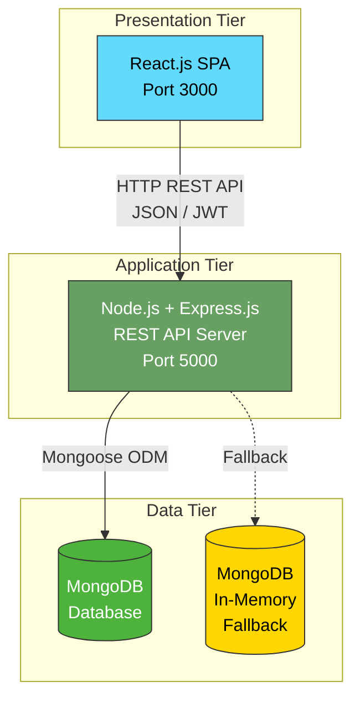

### 4.2 Client-Side Architecture

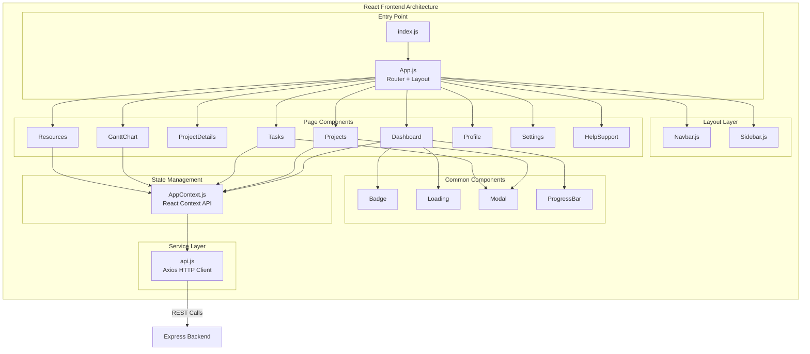

### 4.3 Server-Side Architecture

```mermaid
graph TB
    subgraph "Express.js Backend Architecture"
        direction TB
        
        subgraph "Entry"
            SRV[server.js<br/>Express App Init]
        end

        subgraph "Middleware Layer"
            CORS[CORS]
            JSON[JSON Parser]
            MRG[Morgan Logger]
            AUTH[Auth Middleware<br/>JWT Verify]
            ERR[Error Handler]
        end

        subgraph "Route Layer"
            AR[/api/auth]
            PR[/api/projects]
            TR[/api/tasks]
            RR[/api/resources]
            DR[/api/dashboard]
        end

        subgraph "Controller Layer"
            AC[authController]
            PC[projectController]
            TC[taskController]
            RC[resourceController]
            DC[dashboardController]
        end

        subgraph "Model Layer (Mongoose)"
            UM[User Model]
            PM[Project Model]
            TM[Task Model]
            RM[Resource Model]
        end

        subgraph "Utilities"
            AH[asyncHandler]
            ER2[ErrorResponse]
            SD[seedData]
        end

        subgraph "Database"
            DB[(MongoDB)]
        end
    end

    SRV --> CORS
    SRV --> JSON
    SRV --> MRG
    SRV --> AR
    SRV --> PR
    SRV --> TR
    SRV --> RR
    SRV --> DR
    SRV --> ERR

    AR --> AUTH
    AR --> AC
    PR --> PC
    TR --> TC
    RR --> RC
    DR --> DC

    AC --> UM
    PC --> PM
    PC --> TM
    TC --> TM
    TC --> PM
    RC --> RM
    DC --> PM
    DC --> TM
    DC --> RM

    UM --> DB
    PM --> DB
    TM --> DB
    RM --> DB
```

### 4.4 Deployment Architecture

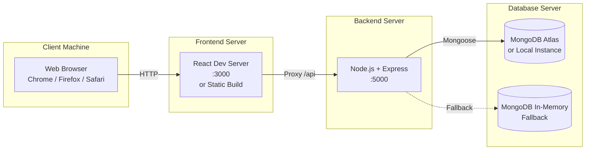

---

## 5. UML Diagrams

### 5.1 Use Case Diagram

```mermaid
graph TB
    subgraph "Project Management Dashboard - Use Cases"
        direction TB
        
        subgraph "Authentication"
            UC1((Register))
            UC2((Login))
            UC3((Logout))
        end

        subgraph "Project Management"
            UC4((View Dashboard))
            UC5((Create Project))
            UC6((View Projects))
            UC7((Update Project))
            UC8((Delete Project))
            UC9((View Project Details))
            UC10((Search/Filter Projects))
        end

        subgraph "Task Management"
            UC11((Create Task))
            UC12((View Tasks))
            UC13((Update Task))
            UC14((Delete Task))
            UC15((Assign Task to Resource))
            UC16((Set Task Dependency))
            UC17((Mark Milestone))
            UC18((Track Progress))
        end

        subgraph "Gantt Chart"
            UC19((View Gantt Chart))
            UC20((Drag & Drop Reschedule))
            UC21((View Dependencies))
        end

        subgraph "Resource Management"
            UC22((Add Resource))
            UC23((View Resources))
            UC24((Update Resource))
            UC25((Delete Resource))
            UC26((View Utilization))
        end

        subgraph "Settings"
            UC27((Manage Profile))
            UC28((Toggle Theme))
        end
    end

    PM[👤 Project Manager]
    TM[👤 Team Member]
    AD[👤 Admin]

    PM --- UC4
    PM --- UC5
    PM --- UC6
    PM --- UC7
    PM --- UC8
    PM --- UC9
    PM --- UC10
    PM --- UC11
    PM --- UC12
    PM --- UC13
    PM --- UC14
    PM --- UC15
    PM --- UC16
    PM --- UC17
    PM --- UC19
    PM --- UC20
    PM --- UC22

    TM --- UC2
    TM --- UC4
    TM --- UC6
    TM --- UC12
    TM --- UC18
    TM --- UC19
    TM --- UC27

    AD --- UC1
    AD --- UC2
    AD --- UC5
    AD --- UC8
    AD --- UC22
    AD --- UC25
    AD --- UC28
```

#### Use Case Descriptions

| Use Case ID | Use Case | Actor(s) | Description |
|-------------|----------|----------|-------------|
| UC1 | Register | Admin | Create a new user account with name, email, password, and role. |
| UC2 | Login | All Users | Authenticate using email and password; receive JWT token. |
| UC3 | Logout | All Users | Clear JWT token and terminate session. |
| UC4 | View Dashboard | Manager, Team Member | View real-time KPIs: project/task counts, status distributions, charts. |
| UC5 | Create Project | Manager, Admin | Create a new project with name, dates, budget, priority, status. |
| UC6 | View Projects | All Users | Browse project list with search, filter, sort, and pagination. |
| UC7 | Update Project | Manager | Modify project details, status, budget, or dates. |
| UC8 | Delete Project | Manager, Admin | Remove a project and its associated tasks. |
| UC9 | View Project Details | Manager | View full project info with task breakdown and stats. |
| UC10 | Search/Filter Projects | All Users | Search by name/description; filter by status, priority, dates. |
| UC11 | Create Task | Manager | Add a task to a project with title, dates, priority, and assignment. |
| UC12 | View Tasks | All Users | List tasks with filtering and status tracking. |
| UC13 | Update Task | Manager | Modify task details, progress, status, or assignment. |
| UC14 | Delete Task | Manager | Remove a task from a project. |
| UC15 | Assign Task to Resource | Manager | Link a task to a team member resource. |
| UC16 | Set Task Dependency | Manager | Define which task must complete before another starts. |
| UC17 | Mark Milestone | Manager | Flag a task as a milestone for Gantt chart display. |
| UC18 | Track Progress | Team Member | Update task progress percentage and actual hours. |
| UC19 | View Gantt Chart | Manager, Team Member | Visualize project timeline with tasks, dependencies, and milestones. |
| UC20 | Drag & Drop Reschedule | Manager | Reschedule tasks by dragging on the Gantt chart. |
| UC21 | View Dependencies | Manager | See dependency arrows between tasks on the Gantt chart. |
| UC22 | Add Resource | Manager, Admin | Add a team member with role, skills, department, availability. |
| UC23 | View Resources | All Users | Browse resource list with utilization data. |
| UC24 | Update Resource | Manager | Modify resource details or availability. |
| UC25 | Delete Resource | Admin | Remove a resource from the system. |
| UC26 | View Utilization | Manager | See resource workload vs. capacity metrics. |
| UC27 | Manage Profile | Team Member | Update personal profile and preferences. |
| UC28 | Toggle Theme | Admin | Switch between dark and light UI themes. |

---

### 5.2 Class Diagram

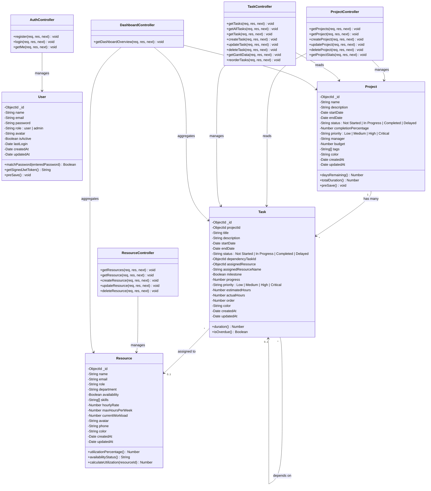

---

### 5.3 Sequence Diagrams

#### 5.3.1 User Login

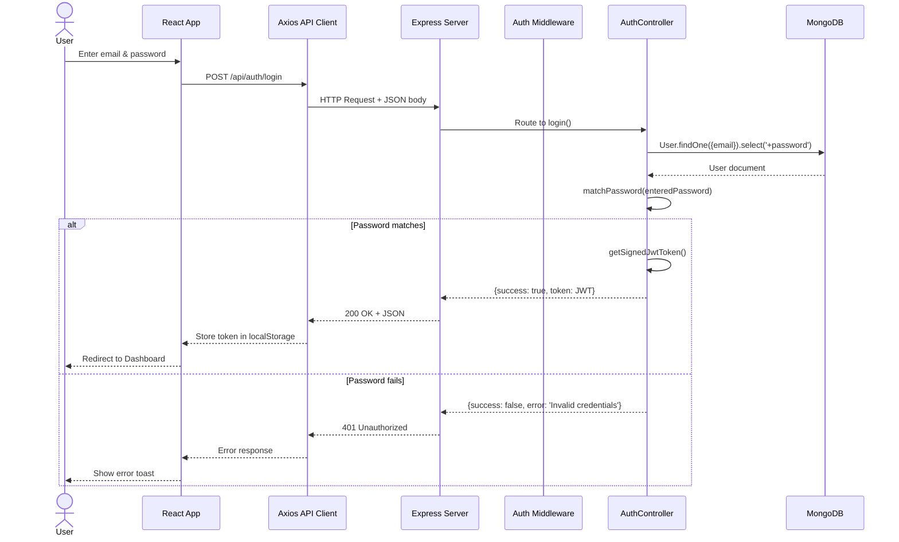

#### 5.3.2 Create Project

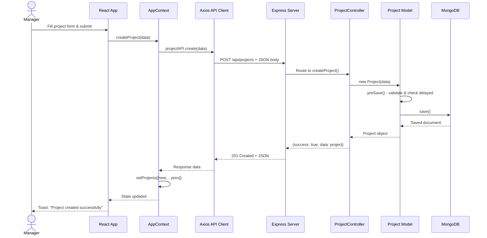

#### 5.3.3 View Dashboard

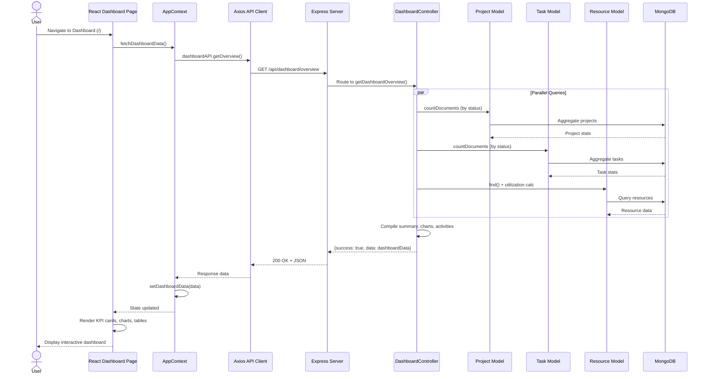

#### 5.3.4 Create & Assign Task

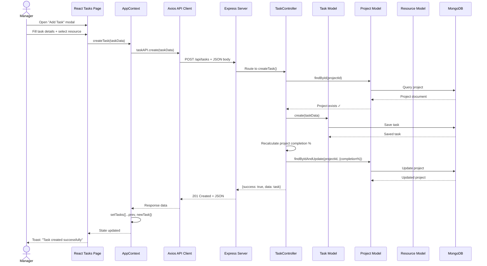

---

### 5.4 Activity Diagrams

#### 5.4.1 Project Lifecycle

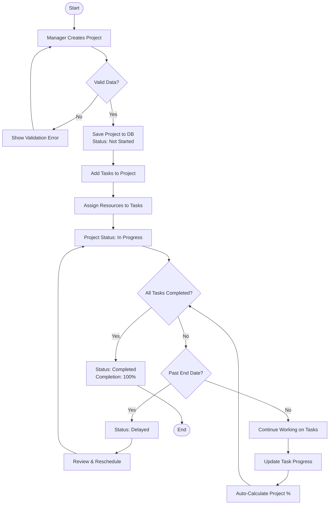

#### 5.4.2 Task Management Flow

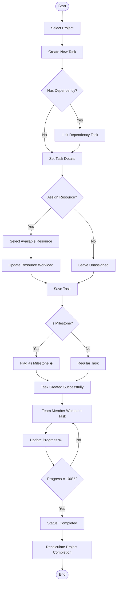

#### 5.4.3 User Authentication Flow

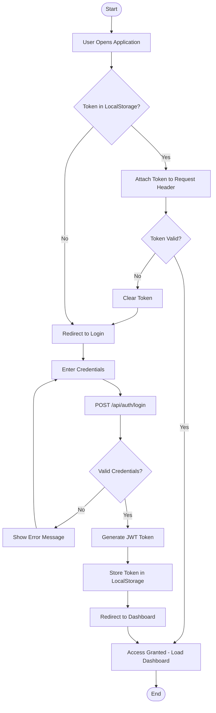

---

### 5.5 Component Diagram

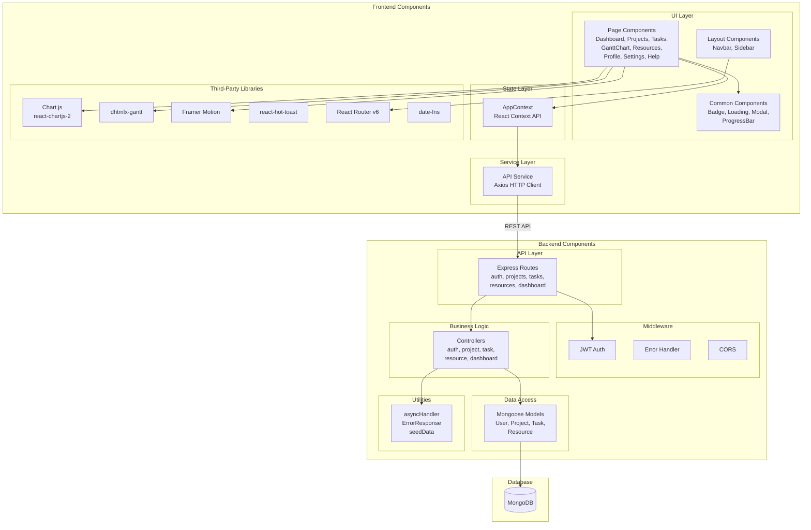

---

### 5.6 Entity-Relationship (ER) Diagram

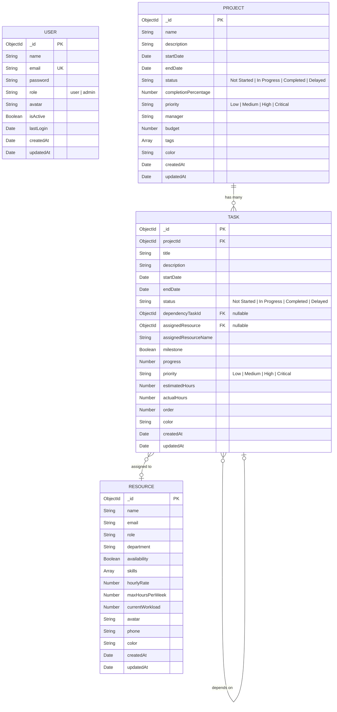

---

### 5.7 State Diagrams

#### 5.7.1 Project State Diagram

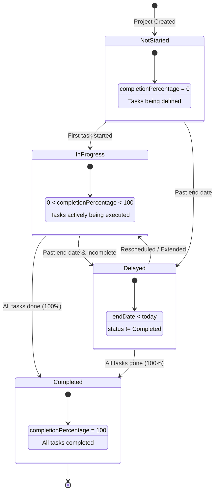

#### 5.7.2 Task State Diagram

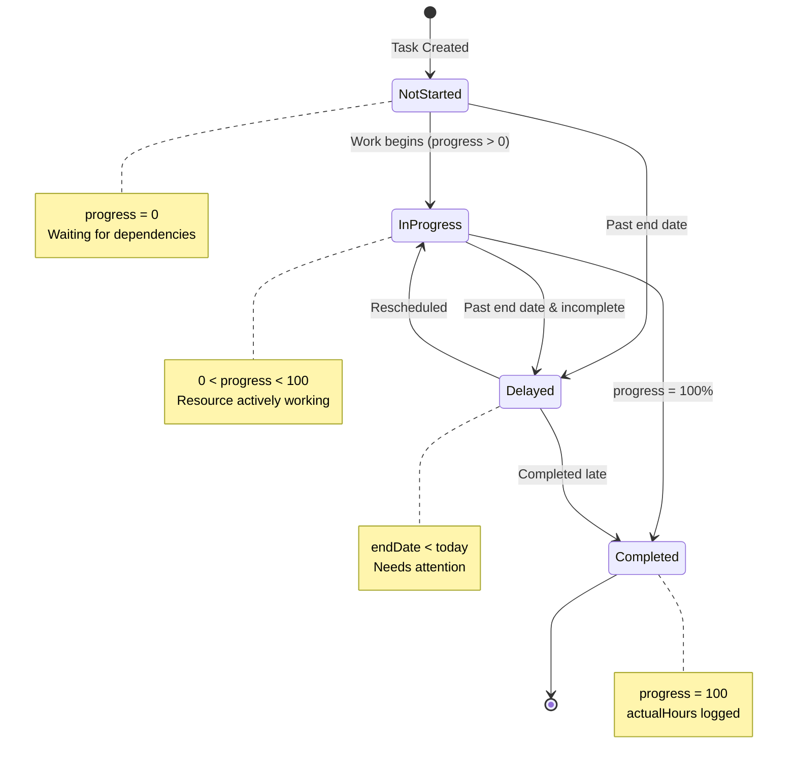

---

### 5.8 Data Flow Diagram (DFD)

#### Level 0 — Context Diagram

```
                         ┌─────────────────────────┐
    Project Data         │                         │   Dashboard KPIs
    Task Data    ───────►│   Project Management    │──────► Reports
    Resource Data        │      Dashboard          │        Charts
    Auth Credentials ───►│      System             │──────► Gantt Views
                         │                         │        Notifications
    ◄────────────────────│                         │
    JWT Token            └─────────────────────────┘
    CRUD Responses
```

#### Level 1 — Major Processes

```
┌──────────────────────────────────────────────────────────────────┐
│                        LEVEL 1 DFD                               │
├──────────────────────────────────────────────────────────────────┤
│                                                                  │
│  ┌──────┐                                                        │
│  │ User │                                                        │
│  └──┬───┘                                                        │
│     │                                                            │
│     │ Credentials                                                │
│     ▼                                                            │
│  ┌──────────────────┐   JWT Token                                │
│  │  1.0 Authenticate │──────────────────────┐                    │
│  │      User         │                      │                    │
│  └──────────────────┘                      │                    │
│                                             ▼                    │
│  ┌──────────────────┐            ┌──────────────────┐            │
│  │  2.0 Manage      │◄──────────│  Auth Middleware  │            │
│  │    Projects       │           │  (Verify Token)  │            │
│  └────────┬─────────┘            └──────────────────┘            │
│           │ Project ID                      ▲                    │
│           ▼                                 │                    │
│  ┌──────────────────┐                      │                    │
│  │  3.0 Manage      │──────────────────────┘                    │
│  │    Tasks          │                                           │
│  └────────┬─────────┘                                           │
│           │ Resource Assignment                                  │
│           ▼                                                      │
│  ┌──────────────────┐                                           │
│  │  4.0 Manage      │                                           │
│  │   Resources       │                                           │
│  └────────┬─────────┘                                           │
│           │ All data flows                                       │
│           ▼                                                      │
│  ┌──────────────────┐         ┌──────────────────┐              │
│  │  5.0 Generate    │────────►│  Dashboard View  │              │
│  │   Dashboard       │         │  (KPIs, Charts)  │              │
│  └──────────────────┘         └──────────────────┘              │
│                                                                  │
│  ┌──────────────────────────────────────────────┐               │
│  │              D1: MongoDB Database             │               │
│  │  ┌──────┐ ┌──────┐ ┌──────┐ ┌──────────┐     │               │
│  │  │Users │ │Projs │ │Tasks │ │Resources │     │               │
│  │  └──────┘ └──────┘ └──────┘ └──────────┘     │               │
│  └──────────────────────────────────────────────┘               │
│                                                                  │
└──────────────────────────────────────────────────────────────────┘
```

---

## API Endpoint Reference

| Method | Endpoint | Controller | Description |
|--------|----------|------------|-------------|
| `POST` | `/api/auth/register` | authController.register | Register new user |
| `POST` | `/api/auth/login` | authController.login | Login & get JWT |
| `GET` | `/api/auth/me` | authController.getMe | Get current user |
| `GET` | `/api/projects` | projectController.getProjects | List all projects |
| `GET` | `/api/projects/:id` | projectController.getProject | Get single project |
| `POST` | `/api/projects` | projectController.createProject | Create project |
| `PUT` | `/api/projects/:id` | projectController.updateProject | Update project |
| `DELETE` | `/api/projects/:id` | projectController.deleteProject | Delete project |
| `GET` | `/api/projects/stats/overview` | projectController.getProjectStats | Project statistics |
| `GET` | `/api/tasks/:projectId` | taskController.getTasks | Get project tasks |
| `GET` | `/api/tasks/all` | taskController.getAllTasks | Get all tasks |
| `GET` | `/api/tasks/detail/:id` | taskController.getTask | Get single task |
| `POST` | `/api/tasks` | taskController.createTask | Create task |
| `PUT` | `/api/tasks/:id` | taskController.updateTask | Update task |
| `DELETE` | `/api/tasks/:id` | taskController.deleteTask | Delete task |
| `PUT` | `/api/tasks/reorder` | taskController.reorderTasks | Reorder tasks |
| `GET` | `/api/tasks/gantt/:projectId` | taskController.getGanttData | Gantt chart data |
| `GET` | `/api/resources` | resourceController.getResources | List resources |
| `GET` | `/api/resources/:id` | resourceController.getResource | Get single resource |
| `POST` | `/api/resources` | resourceController.createResource | Add resource |
| `PUT` | `/api/resources/:id` | resourceController.updateResource | Update resource |
| `DELETE` | `/api/resources/:id` | resourceController.deleteResource | Delete resource |
| `GET` | `/api/dashboard/overview` | dashboardController.getDashboardOverview | Dashboard stats |

---

## Summary

This document provides a complete system analysis and design for the **Project Management Dashboard** application:

- **Existing System** — Identified the manual, spreadsheet-driven workflows and their limitations.
- **Proposed System** — Detailed the MERN-stack solution with real-time dashboards, interactive Gantt charts, and resource management.
- **Architecture** — Presented three-tier (Presentation → Application → Data) architecture with detailed client-side, server-side, and deployment views.
- **UML Diagrams** — Provided 8 diagram types:
  - **Use Case Diagram** — 28 use cases across 3 actor types
  - **Class Diagram** — 4 models + 5 controllers with relationships
  - **Sequence Diagrams** — Login, Create Project, Dashboard, and Task Assignment flows
  - **Activity Diagrams** — Project lifecycle, task management, and authentication flows
  - **Component Diagram** — Full frontend/backend component mapping
  - **ER Diagram** — Database schema with all entities and relationships
  - **State Diagrams** — Project and task state machines
  - **Data Flow Diagram** — Context (Level 0) and Process (Level 1) DFDs
